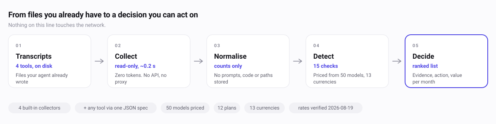

<div align="center">


# AI&nbsp;Observatory

**Know what to change about your AI coding.**

Your coding agent already logs every turn. This reads those logs and tells you
the few changes worth making — each with a number attached.

[](https://github.com/jxxyx-bloop/ai-observatory/actions/workflows/ci.yml)
[](https://github.com/jxxyx-bloop/ai-observatory/actions/workflows/site.yml)


**[Live demo](https://aiobservatory.dev/demo/)** ·
[Quick start](#quick-start) ·
[Why it's different](#why-its-different) ·
[Privacy](#privacy) ·
[Docs](docs/)

<sub>
<a href="https://aiobservatory.dev/">English</a> ·
<a href="docs/readme/README.zh-Hans.md">简体中文</a> ·
<a href="docs/readme/README.zh-Hant.md">繁體中文</a> ·
<a href="docs/readme/README.ja.md">日本語</a> ·
<a href="docs/readme/README.ko.md">한국어</a> ·
<a href="docs/readme/README.hi.md">हिन्दी</a> ·
<a href="docs/readme/README.id.md">Indonesia</a> ·
<a href="docs/readme/README.vi.md">Tiếng Việt</a> ·
<a href="docs/readme/README.th.md">ไทย</a> ·
<a href="docs/readme/README.ms.md">Melayu</a> ·
<a href="docs/readme/README.fil.md">Filipino</a> ·
<a href="docs/readme/README.pt-BR.md">Português</a> ·
<a href="docs/readme/README.es.md">Español</a>
</sub>

<br>

<a href="https://aiobservatory.dev/demo/">


</a>

<sub>Every image in this file is generated from the live product — see
[Self-updating visuals](#self-updating-visuals).</sub>

</div>

---

## The output

Not a number. A next move.

Here is the whole report for someone running **Claude Code and nothing else** —
the most common setup, and the one where a usage tool usually has least to say:

```text
[MEDIUM] Some sessions carry a very large context per turn
         43 sessions peaked above 300,000 tokens on one turn (worst: 878,246).
         Every later turn re-reads all of it.
      1. Finish the thread. Start the next piece of work in a new session.
      2. Carry forward only what that work needs.

[MEDIUM] Almost everything runs through anthropic
         100% of your output tokens came from one vendor. A rate change, a
         regional outage or a quota cut is a single point of failure for your
         whole workflow — and you have no baseline to compare a switch against.
      1. Run one low-stakes, recurring class of work on a second vendor for a
         fortnight. Not to save money — to know what switching would cost.

[INFO]   Cache is doing its job
         89.3% of everything the models read came from cache rather than
         being re-billed at full input rate.
      1. No action. Watch it — a fall means sessions are being restarted
         more often than they need to be.
```

**No HIGH finding, and none invented.** That report is what healthy usage looks
like here. Fifteen checks run; anything worth under **$15 a month is demoted**,
so the top of the list always means something. A tool that manufactures a
problem to look useful is a tool you stop believing.

Now add a second vendor, and a finding appears that no other open-source
tracker can produce at all:

```text
[HIGH]   You are buying tokens at peak rates you did not have to pay   ≈ $21/mo
         66.9% of your time-priced spend (deepseek, zhipu) ran inside a peak
         window, at up to twice the off-peak rate. That cost $39.39.
      1. Queue unattended work for an off-peak hour — tests, migrations,
         doc sweeps, bulk refactors.
      2. Leave interactive work alone: the premium buys your attention.
      3. Windows are narrow. DeepSeek 01:00-04:00 and 06:00-10:00 UTC.
         GLM 14:00-18:00 UTC+8, weekdays only.
```

Both blocks are copied from real runs of the engine — the first from the demo
filtered to Claude Code alone, the second from the full
[live demo](https://aiobservatory.dev/demo/). Neither was written for this page.

## How it works

<picture>
  <source media="(prefers-color-scheme: dark)" srcset="docs/assets/pipeline-dark.svg">
  
</picture>

## Quick start

```bash
uvx ai-observatory setup
```

One command, nothing to install first, nothing left behind. It checks your
machine, reads the logs your agents already wrote on this disk, builds your
dashboard and opens it. It prints each step as it runs — a command that stays
silent for eight seconds looks exactly like one that has crashed.

Prefer `pipx run ai-observatory setup`, or `pip install ai-observatory` for a
permanent one. All three give you the same `ai-observatory` command.

**Python 3 standard library only.** No dependencies to resolve, no build step,
no account, no network — the wheel is the code and nothing else, which is why
this runs on a machine that has never installed a Python package.

Want to look first, without installing anything at all? The
[live demo](https://aiobservatory.dev/demo/) is the real dashboard, built from
60 days of sample data by the same code you would run yourself.

<details>
<summary>Prefer to run the steps yourself</summary>

```bash
ai-observatory demo digest report   # 60 days of sample data, to look around
ai-observatory demo --purge         # remove it before collecting your own
ai-observatory all                  # read, measure, build — on your usage
ai-observatory install              # the app, the Dock icon, a daily refresh
```

Installed this way, everything lives in `~/.ai-observatory` — your event store,
your dashboard, and the `settings.json` and `topology.json` you edit. The rate
card stays in the package so an upgrade delivers corrected prices; drop a file
of the same name beside your settings to override it.

Do not skip the purge. Sample data left in the store is counted as if it were
yours, and it is built to show every problem the tool can find.

`install` writes `~/Applications/AI Observatory.app` on macOS — a 3 KB shell
script in a bundle, not an Electron build. It is *made on your machine, not
downloaded*, so Gatekeeper never prompts and nothing needs signing.

| Flag | Effect |
|---|---|
| `--no-dock` | Skip pinning to the Dock. By default `install` pins it, because an app you cannot find is an app you will not open; `--remove` unpins it again. |
| `--no-daily` | Skip the scheduled refresh. Otherwise it runs at 09:00 and once at login, so a machine that was off at nine is still current when you sit down. |
| `--no-open` | Install silently — for scripts. |
| `--remove` | Undo all of it. |

Everything it writes lives under `$HOME`, and nothing it does touches `data/`.

</details>

<details>
<summary><b>From a checkout</b> — for contributors, and for the Dock icon</summary>

<br>

```bash
git clone https://github.com/jxxyx-bloop/ai-observatory.git
cd ai-observatory/observatory && python3 observe.py setup
```

Identical engine, run in place: `data/` and `dist/` sit beside `observatory/`,
and the four JSON config files are the ones in the repo. This is the path to
take if you intend to send a pull request, and the only one that can install
the macOS launcher — `install` builds a bundle that calls `observe.py` by path,
so it needs a checkout to point at. `ai-observatory install` says so and stops
rather than writing a launcher that cannot work.

</details>

### When something looks wrong

```bash
ai-observatory doctor     # checks each step, prints the fix for what failed
```

The dashboard also dates itself. A report more than a day old says so above the
title and hands you the line that refreshes it. It works that out from its own
timestamp, so it needs no network — a file can never be told that a newer one
exists, but it can always know its own age.

<details>
<summary><b>Your first five minutes</b> — the three edits that are worth making</summary>

<br>

**1. Say where your repos live.** Put your code directories in `code_roots` in
[`topology.json`](observatory/topology.json). Without this, work shows as
`unattributed` instead of by project.

```bash
ai-observatory sync --full digest report   # --full after any topology change
```

**2. Set two fields** in `settings.json` — `~/.ai-observatory/settings.json`
when installed, [`observatory/settings.json`](observatory/settings.json) in a
checkout:

| Field | Set it to |
|---|---|
| `currency` | `IDR`, `VND`, `THB`, `PHP`, `MYR`, `SGD`, `CNY`… or leave `USD` |
| `plan` | your subscription id from [`plans.json`](observatory/plans.json), or `none` |

Not your timezone — `timezone_offset_hours` is `"auto"` and follows the machine,
so the heatmap is on your clock whether you are in Singapore, Seoul or Berlin.
Set it to a number only if you want a different one.

Setting `plan` turns a dollar figure you do not recognise into *"your $18 plan
returned 23× what you paid."*

**3. Make it a habit.** Zero tokens, ~0.2 s:

```cron
0 9 * * *  ai-observatory all
```

</details>

<details>
<summary><b>Commands</b></summary>

<br>

| Command | What it does |
|---|---|
| `ai-observatory sync` | Collect new events into `data/` (incremental, ~0.2 s) |
| `ai-observatory digest` | Aggregate + run the detectors → `data/digest.json` |
| `ai-observatory report` | Render → `dist/observatory.html` |
| `ai-observatory insights` | Print the findings as text — for reading inside an agent session |
| `ai-observatory setup` | The whole install in one command — check, update, collect, build, pin, open |
| `ai-observatory doctor` | Check every step and print the fix for whichever failed |
| `ai-observatory demo` | 60 deterministic days of synthetic usage |
| `ai-observatory demo --purge` | remove that synthetic usage from the store again |
| `ai-observatory share` | Build the community payload and **print it** — never uploads |
| `ai-observatory all` | sync → digest → report |
| `ai-observatory dedupe` | Repair a store that holds the same turn twice — keeps the first copy |
| `ai-observatory check-update` | Fetch what is new. Downloads objects, runs none of them |
| `ai-observatory update` | Fast-forward onto whatever `check-update` already fetched |
| `ai-observatory install` | Create the double-clickable launcher and the daily refresh |

Commands compose: `ai-observatory sync digest report` is one process. Flags modify
a command and never stand alone — `ai-observatory --help` prints this list rather than
running anything.

</details>

<details>
<summary><b>If something looks wrong</b></summary>

<br>

| Symptom | Cause |
|---|---|
| `no events found` | None of the collector paths exist. Check `ls ~/.claude/projects`. |
| Everything is `unattributed` | `code_roots` doesn't match where your repos are. |
| Repo names wrong after editing `topology.json` | Attribution bakes in at sync time — re-run `sync --full`. |
| Costs look implausible | Check `_verified_on` in [`pricing.json`](observatory/pricing.json). Correcting a rate is a one-line PR. |
| A finding seems wrong | That's a bug worth an issue — credibility is the whole product. |

</details>

## Why it's different

<picture>
  <source media="(prefers-color-scheme: dark)" srcset="docs/assets/peak-clock-dark.svg">
  
</picture>

| | Typical token tracker | AI Observatory |
|---|---|---|
| Reports what you spent | ✅ | ✅ |
| Tells you what to change | — | **15 detectors, with evidence** |
| Peak / off-peak pricing | flat rate for every vendor | **priced at the rate in force** |
| Plan value vs metered cost | — | **return multiple, or "downgrade"** |
| Local currency | usually USD only | **13, against a local day rate** |
| Leaderboard ranks | total tokens burned | **efficiency** |
| Runs with no account | usually | **always** |

<details>
<summary><b>Each claim, in detail</b></summary>

<br>

**Priced on your vendor's clock.** DeepSeek charges full rate 01:00–04:00 and
06:00–10:00 UTC, half the rest of the time. GLM charges full rate 14:00–18:00
UTC+8, weekdays only. If you work anywhere from UTC+7 to +9, that is your
afternoon — you pay the higher rate every day without choosing to. Every turn is
priced at the rate that applied when it ran, so the extra is worked out from
your own tokens, not estimated. **No other open-source tracker does this.**

**Per-vendor cache economics.** The 0.1× cache-hit discount is an Anthropic
convention, not a law — Kimi K2.6 sits near 0.074×. Cache is where the money
is, so a wrong multiplier misprices the most important number on the page.

**Plan value, not fake dollars.** On an $18 plan, "you spent $412" is not a
bill you will ever receive. The number worth knowing is **23× return** — or,
when it goes the other way, *"you are paying for room you never use."*

**Adding your tool is one JSON file.** Describe where its logs live and what
the fields are called — [an example](observatory/collectors/specs/README.md) —
plus one sample file to test against. No Python. If you use Lingma, Qwen Code,
CodeBuddy or Comate, **you are the only person who can add it correctly.**

**The community layer ranks efficiency, not consumption.** Existing leaderboards
rank total tokens burned; the top of that board is whoever wasted the most. We
rank cache reuse, tokens per change, cost per active hour, peak discipline and
plan-value multiple. Improvable, and fair across budgets.
*Opt-in, default off, not yet shipped —
see the [protocol](docs/specs/Community-Share-Protocol.md).*

</details>

## Privacy

**Nothing leaves your machine unless you edit a file to say so.**

| | |
|---|---|
| **Never stored** | prompt text · completion text · thinking content · file contents · tool arguments · shell commands · absolute paths |
| **What is stored** | counts, model names, tool names, and coarse derived labels like `app:checkout` |
| **Where it's enforced** | dropped as each file is read, not cleaned up afterwards — so anything reaching the store is a bug, not a policy call ([ADR-006](docs/adr/ADR-006-Metadata-Only.md), [ADR-008](docs/adr/ADR-008-Derived-Path-Labels.md)) |
| **Network** | the dashboard and the site make **zero external requests**. No CDN, no fonts, no analytics. |

If you ever turn on the community layer, what it would send is under a
kilobyte, and every number in it is a range rather than a value — no repository
name, no session id, nothing that identifies you.
[`ai-observatory share`](observatory/share.py) prints the whole thing, and contains
no code that can send it anywhere.

## What it can read

| Tool | Reads from |
|---|---|
| Claude Code | `~/.claude/projects/**/*.jsonl` |
| Codex | `~/.codex/sessions/**/*.jsonl` |
| Kimi Code | `~/.kimi-code/sessions/**/wire.jsonl` |
| Antigravity | `~/.gemini/antigravity/brain/**` |
| **Anything else** | a [declarative spec](observatory/collectors/specs/README.md) — one JSON file, no Python |

Collection is read-only and costs zero tokens.
**Especially wanted:** Qwen Code, iFlow CLI, CodeBuddy, Trae, Lingma / 通义灵码,
Comate, Doubao, CodeGeeX, Cline, Roo Code, Aider, OpenCode, Goose, Zed.

## The site

<div align="center">


</div>

```bash
python3 site/build.py     # → site/dist/  (13 locales + the live demo dashboard)
```

Thirteen languages, dark mode, and a demo that is the real dashboard rather than
a screenshot of one. Design rules live in
[`DESIGN-SYSTEM.md`](docs/design/DESIGN-SYSTEM.md); every surface inlines the
same [token file](observatory/assets/tokens.css).

CI checks that the site builds. It never deploys, so **no deploy key is stored
in GitHub and there is nothing to leak**. Cloudflare deploys from the repo
itself, reading the build command out of [`wrangler.toml`](wrangler.toml) —
**nothing to configure in any dashboard**. About **$1/month at launch, $6 at
100k users** ([ADR-015](docs/adr/ADR-015-Hosting-And-Data-Residency.md),
[DEPLOY.md](docs/setup/DEPLOY.md)).

### Self-updating visuals

Nothing in this README is drawn by hand.

| Asset | Generated by | From |
|---|---|---|
| `pipeline-*.svg`, `peak-clock-*.svg` | [`site/tools/diagrams.py`](site/tools/diagrams.py) | `pricing.json`, `plans.json`, `insights.py`, `collectors/` |
| `landing-*.png`, `demo-*.png` | [`site/tools/shots.js`](site/tools/shots.js) | headless Chromium against the real built site |

[`visuals.yml`](.github/workflows/visuals.yml) reruns both on every push that
touches the site or the rate card and commits what changed, and
[`site.yml`](.github/workflows/site.yml) fails a PR whose figures no longer
match the data. A redesign updates its own documentation.

## Docs

| Path | Contents |
|---|---|
| [`docs/strategy/`](docs/strategy/) | **Competitive teardown · positioning · the SEA/China thesis · growth flywheel · risks** |
| [`docs/design/`](docs/design/) | **The design system** — tokens, voice, and the zero-network rule |
| [`docs/00-*.md`](docs/) | Vision · engineering principles · architecture · decision log |
| [`docs/adr/`](docs/adr/) | Fifteen decision records, including what was rejected and why |
| [`docs/specs/`](docs/specs/) | Event schema · cost estimation · peak/off-peak · plans · community protocol · auth |
| [`docs/context/`](docs/context/) | Glossary · **known limitations** |

> **Read [Known-Limitations](docs/context/Known-Limitations.md) before trusting
> any finding about value.** This tool measures where effort went precisely, and
> what it produced only by proxy.

## Status

| | |
|---|---|
| Engine, collectors, dashboard, 15 detectors | **working, tested** |
| Peak/off-peak pricing, plan value, currency | **working, tested** |
| One command to install, Dock icon, 09:00 refresh | **working** |
| Dashboard says when it has gone stale | **working** |
| Clock follows the machine you run it on | **working** |
| Landing page (13 locales), hosted demo, setup guide | **working** |
| Community layer — accounts, cohorts, leaderboard | **specified, not built** |

See [ROADMAP.md](docs/ROADMAP.md).

## Contributing

Three useful contributions, in ascending order of effort:

1. **Fix a stale price** in `pricing.json` — one line and a citation.
2. **Add a plan** to `plans.json`.
3. **Add your coding tool** via a [collector spec](observatory/collectors/specs/README.md) and a fixture.

A fourth: **improve a translation.** All landing-page copy is in
[`site/i18n.py`](site/i18n.py), all dashboard copy in
[`observatory/assets/i18n.js`](observatory/assets/i18n.js) — one dict per
language, no framework.

```bash
observatory/tests/run.sh                 # engine, collectors, dashboard
python3 site/build.py                    # every locale
python3 site/tools/check_no_remote.py site/dist
```

See [CONTRIBUTING.md](CONTRIBUTING.md).

## Licence

[MIT](LICENSE).
