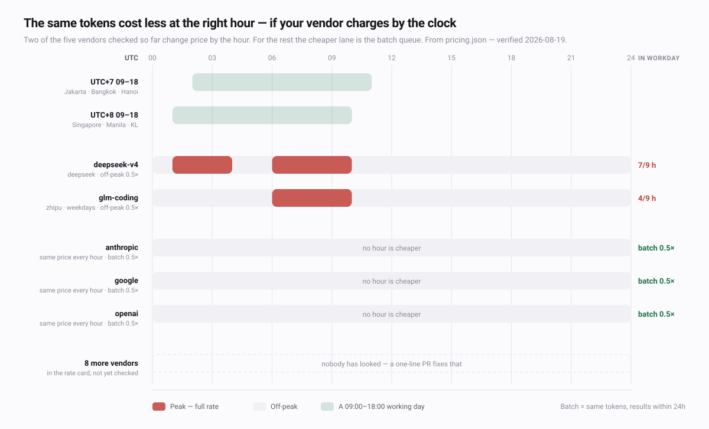

<!-- Generated by site/tools/readmes.py from site/i18n.py. Do not edit by hand:
     edit the strings there and re-run, or the next build will overwrite this. -->

<div align="center">


# AI&nbsp;Observatory

**何を 変えるべきか**

エージェントは毎ターンをすでに記録しています。そのログを読み、手を打つ価値のある数点だけを、数字つきで示します。

`設定は1分もかからない` · `アカウント不要` · `データは端末の外に出ない`

**[デモを開く](https://ai-observatory.workers.dev/demo/)** · [AI Observatory](https://ai-observatory.workers.dev/ja/) · [GitHub](https://github.com/jxxyx-bloop/ai-observatory)

<sub>
<a href="../../README.md">English</a> ·
<a href="README.zh-Hans.md">简体中文</a> ·
<a href="README.zh-Hant.md">繁體中文</a> ·
<b>日本語</b> ·
<a href="README.ko.md">한국어</a> ·
<a href="README.hi.md">हिन्दी</a> ·
<a href="README.id.md">Bahasa Indonesia</a> ·
<a href="README.vi.md">Tiếng Việt</a> ·
<a href="README.th.md">ไทย</a> ·
<a href="README.ms.md">Bahasa Melayu</a> ·
<a href="README.fil.md">Filipino</a> ·
<a href="README.pt-BR.md">Português (BR)</a> ·
<a href="README.es.md">Español</a>
</sub>

<br>

<a href="https://ai-observatory.workers.dev/demo/">


</a>

</div>

---

## 数字ではなく、次の一手を

> **高** — 払わなくてよいピーク料金を払っています · **≈ 月34ドル**<br>
> 時間帯課金モデルでの支出の61%がピーク時間帯に入っており、同じトークンが最大2倍の値段になっています。<br>
> → 見ている必要のない作業（テスト生成・移行・ドキュメント整理）はオフピーク帯に回してください。

> **中** — コンテキストを再利用せず、作り直しています · **≈ 月61ドル**<br>
> キャッシュ再利用率は38%。コンテキストの再構築は、読み戻すおよそ12倍のコストがかかります。<br>
> → 関連する作業は同じセッションで続けてください。この差はモデルの入れ替えより効きます。

> **低** — 月18ドルのプランが23倍を返しています · **23倍**<br>
> 従量課金なら同じ作業に412ドルかかっていました。ここに直すところはありません。<br>
> → このまま継続を。月間ターンが400を下回ったら再検討してください。

15種類の検査。月15ドル未満の項目は格下げされるので、上位は常に意味があります。健全な使い方は、健全と報告します。

## クイックスタート

```bash
git clone https://github.com/jxxyx-bloop/ai-observatory
cd ai-observatory/observatory
python3 observe.py demo digest report
```

次に、自分の使用状況に対して実行します。

```bash
python3 observe.py demo --purge
python3 observe.py all
```

Python 3 標準ライブラリのみ。インストール・依存・ビルド、いずれも不要。

## 3ステップ、約1秒

| | | |
|---|---|---|
| **01 読む** | **02 測る** | **03 動く** |
| エージェントがすでにログを書いています。その場のファイルをそのまま読むだけ——インストールも、有効化も不要です。 | トークン、キャッシュ、時間帯、コスト。実行された時点で有効だった料金で計算します。 | 優先順位つきの変更リスト。根拠と、月あたりの価値が必ず添えられます。 |

APIキー・プロキシ・アカウント・通信、いずれも不要。収集自体のトークン消費はゼロです。

<picture>
  <source media="(prefers-color-scheme: dark)" srcset="../assets/peak-clock-dark.svg">
  
</picture>

## 実際の支払い方に合わせて計算する

| | |
|---|---|
| **時刻で価格が変わる** | DeepSeekとGLMは時間帯課金です。UTC+7〜+9では、そのピーク帯がちょうど仕事の午後にあたります。 |
| **プランは請求書ではない** | 月18ドルのプランで「412ドル使った」は作り話です。「23倍」は違います。 |
| **キャッシュ料率はベンダーごとに違う** | 0.1倍はAnthropicの慣習であって法則ではありません。ここを外すと、最重要の数字が狂います。 |
| **13の通貨** | IDR・VND・THB・PHP・MYRほか。現地の日当と並べて示します。412ドルの重みは、どこでも同じではありません。 |

## 仕組みそのものが守る

**設定ファイルを自分で書き換えない限り、データは端末の外に出ません。**

- 決して保存しないもの：プロンプト、応答、コード、コマンド、ファイルパス。
- ファイルを読むそばから捨てるので、ダッシュボードには届きません。
- ダッシュボードもこのページも外部リクエストはゼロ。CDNもフォントも解析タグもありません。

## ドキュメント

設定・コマンド・コントリビュートを含む完全なドキュメントは英語です。

- [README](https://github.com/jxxyx-bloop/ai-observatory#quick-start)
- [既知の制限](https://github.com/jxxyx-bloop/ai-observatory/blob/main/docs/context/Known-Limitations.md)
- [コントリビュート](https://github.com/jxxyx-bloop/ai-observatory/blob/main/CONTRIBUTING.md)

読みづらい箇所があれば。このページの文言はすべて `site/i18n.py` の言語ごとの辞書にあります。ファイル1つ、フレームワークなし。

---

<sub>MITライセンス · ローカルファースト · アカウント不要 · サイトと同じ文言から生成しているので、このページとサイトが食い違うことはありません。</sub>
